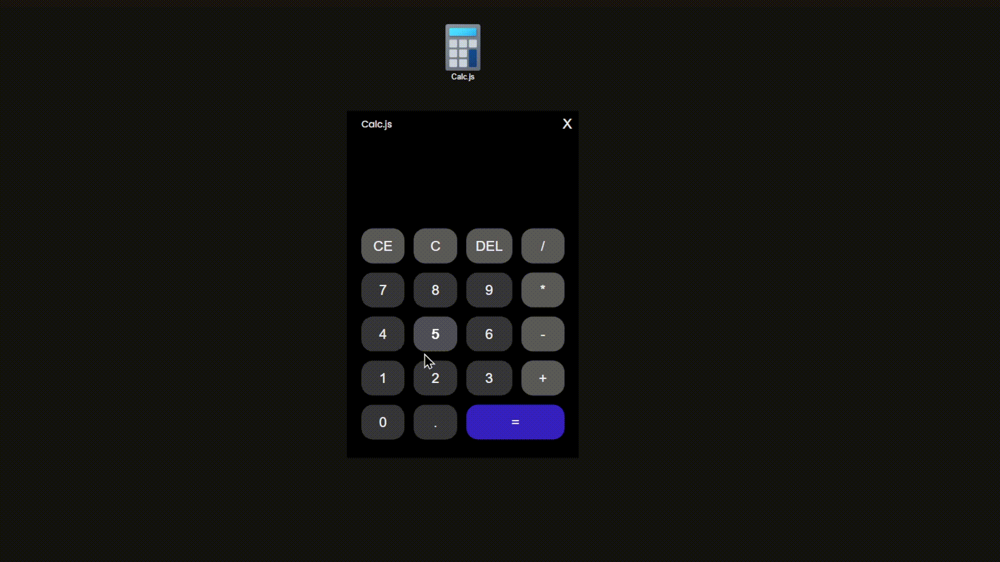

# Calc.js
 Caculadora criada em JavaScript sem usar a Função de Objeto Global eval() | 
 Calculator created in JavaScript without using the Global Object Function eval()

  

## Description
A Calculadora pode fazer contas com número decimais e naturais e também com as Quatro Operações Básicas Adição, Subtração, Multiplicação e Divisão.
## Drag and Drop

  

Você também pode abrir a Calculadora como se um programa e Também arrasto-o e solta-lo pela tela.